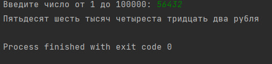
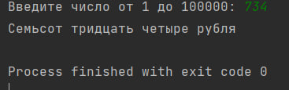
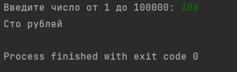
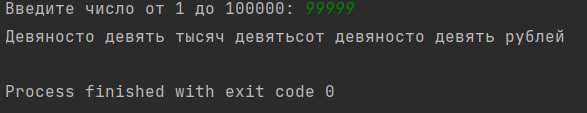

# Исполнитель Шевцов Михаил
Группа: Фт-220007
# Краткое описание программы
Написать на любом языке программу: пользователь вводит число от 1 до 100 000(сумму выдачи в банкомате). Необходимо вывести на экран словами введенную сумму и в конце написать название валюты (рубли) с правильным окончанием.Например: 7431 –семь тысяч четыреста тридцать один рубль, 2149 –две тысячи сто сорок девять рублей, 15 –пятнадцать рублей, 3 –три рубля.Обеспечить проверку ввода чисел
# Среда разработкиЯзык программирования: Python
Среда разработки: PyCharm Edu 2022.2.2
# Инструкция по работе
По запросу программы необходимо ввести число от 1 до 100000. На экране должно вывестись введенная пользователем сумма в словарном представлении. 
Нужно открыть файл с расширением py Лаб. 4.py в среде PyCharm и ввести любое число от 0 до 100 000.
Для успешного использования программы необходмо иметь установленную библиотеку num2words 
# Скриншоты тестов:

